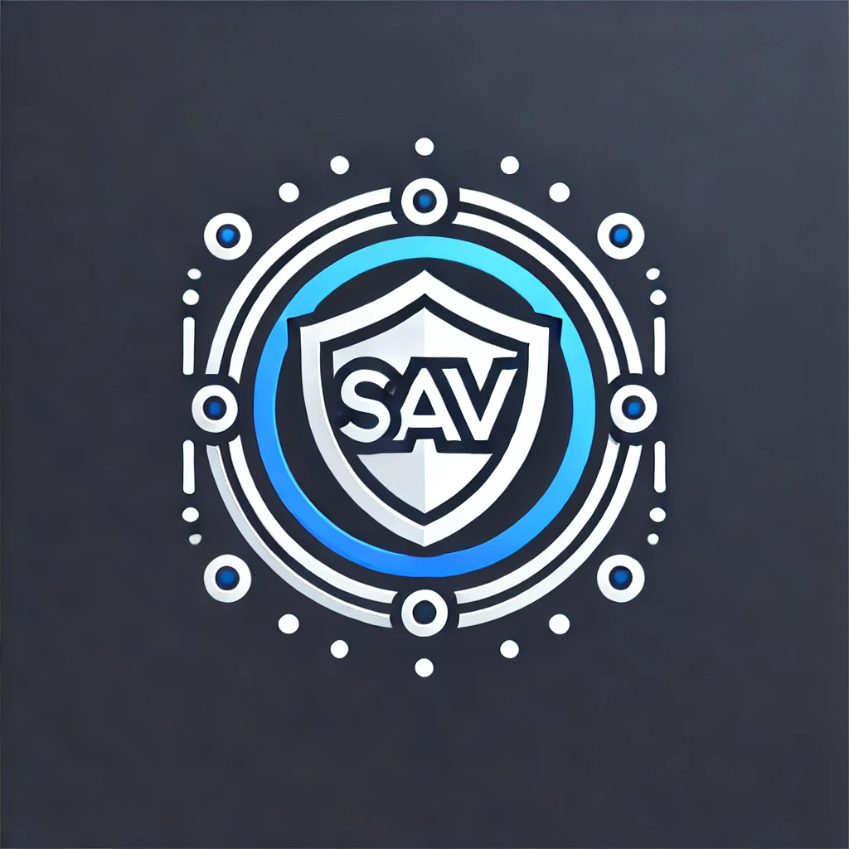

# COS40005_AntiVirusProject

<!-- Improved compatibility of back to top link: See: https://github.com/othneildrew/Best-README-Template/pull/73 -->
<a id="readme-top"></a>

<!-- PROJECT SHIELDS -->
<!--
*** I'm using markdown "reference style" links for readability.
*** Reference links are enclosed in brackets [ ] instead of parentheses ( ).
*** See the bottom of this document for the declaration of the reference variables
*** for contributors-url, forks-url, etc. This is an optional, concise syntax you may use.
*** https://www.markdownguide.org/basic-syntax/#reference-style-links
-->


<!-- PROJECT LOGO -->
<br />
<div align="center">
  <a href="https://github.com/othneildrew/Best-README-Template">
    
  </a>

  <h3 align="center">SAV</h3>

  <p align="center">
    SAV is an awesome and Simple AntiVirus project made by a small team of student at Swinburne Uni!
    <br />
    <a href="https://github.com/A1tered/COS40005_AntiVirusProject"><strong>Explore the docs »</strong></a>
    <br />
    <br />
    <a href="https://github.com/A1tered/COS40005_AntiVirusProject">View Demo</a>
    ·
    <a href="https://github.com/A1tered/COS40005_AntiVirusProject/issues/new?labels=bug&template=bug-report---.md">Report Bug</a>
    ·
    <a href="https://github.com/A1tered/COS40005_AntiVirusProject/issues/new?labels=enhancement&template=feature-request---.md">Request Feature</a>
  </p>
</div>


<!-- TABLE OF CONTENTS -->
<details>
  <summary>Table of Contents</summary>
  <ol>
    <li>
      <a href="#about-the-project">About The Project</a>
      <ul>
        <li><a href="#built-with">Built With</a></li>
      </ul>
    </li>
    <li>
      <a href="#getting-started">Getting Started</a>
      <ul>
        <li><a href="#prerequisites">Prerequisites</a></li>
        <li><a href="#installation">Installation</a></li>
      </ul>
    </li>
    <li><a href="#usage">Usage</a></li>
    <li><a href="#roadmap">Roadmap</a></li>
    <li><a href="#contributing">Contributing</a></li>
    <li><a href="#license">License</a></li>
    <li><a href="#contact">Contact</a></li>
    <li><a href="#acknowledgments">Acknowledgments</a></li>
  </ol>
</details>


<!-- ABOUT THE PROJECT -->
## About The Project

Simple Antivirus (SAV) is a lightweight and effective antivirus solution designed to protect Windows computers from potentially malicious activities, files, and processes. This project aims to deliver a simple yet powerful tool that runs quietly in the background, safeguarding your device through various detection methods including signature-based detection, heuristics, and behavior analysis.

Key Features:
* Installation Script: Easily set up SAV on your Windows machine with a straightforward installation script.
* File and Disk Scanning: Quickly scan your files and disks to identify potentially harmful code, with options to quarantine or delete detected threats.
* Real-Time Monitoring: Continuously monitor suspicious CMD and PowerShell commands, alerting users to any unusual activity.
* Quarantine Management: Users can manage quarantined files, with options to unquarantine or permanently erase them.
* File Hash Checking: Verify the integrity of files with hash checking, with an option for users to add custom file hashes for personalized protection.
* Integrity Checking: Ensure the security of sensitive files through advanced integrity checks, protecting against tampering.
* Tamper Prevention: Robust techniques are in place to prevent tampering with the antivirus, including secure configuration, input validation, memory protection, and more.


SAV is designed to be a user-friendly yet powerful antivirus solution, providing essential protection without overwhelming users with unnecessary features or complexity. Whether you're a casual user or a more advanced one, SAV offers reliable security that integrates seamlessly into your daily workflow.

The Simple Antivirus (SAV) project was initiated on the 27th of Febuary, with the goal of developing a robust yet simple antivirus solution for Windows users. The project was conceptualized, planned, and executed by a dedicated team of developers, including Tim, Zach, Pawan, Chris, Joel, and Johann. Each team member contributed their expertise to various aspects of the project, from coding the core functionalities to planning and implementing the detection mechanisms. This teams collaborative efforts have resulted in a reliable and user-friendly antivirus solution that meets the needs of a wide range of users.

<p align="right">(<a href="#readme-top">back to top</a>)</p>


### Built With

This section should list any major frameworks/libraries used to bootstrap your project. Leave any add-ons/plugins for the acknowledgements section. Here are a few examples.

* [![.NET 8.0][.NET8.0.js]][.NET8.0-url]
* [![WPF UI][WPFUI.js]][WPFUI-url]
* [![SQLite][SQLite.js]][SQLite-url]

<p align="right">(<a href="#readme-top">back to top</a>)</p>


<!-- Repo Structure -->
## Repository Structure

The repository is organized into two main folders: AntiVirus and ProofConcepts. Each folder serves a distinct purpose in the development and organization of the Simple Antivirus (SAV) project.

* AntiVirus:
This folder contains the core of the project, where the final, integrated version of the Simple Antivirus resides. All team members contribute their completed functionalities here, ensuring that the antivirus is cohesive and fully functional. The AntiVirus folder is the central hub where all features, from real-time monitoring to file scanning, come together to form the finished product.

* ProofConcepts:
The ProofConcepts folder is a dedicated space for experimentation and development of individual functionalities. Here, team members create drafts, prototypes, and test versions of the components before they are finalized. This allows for iterative development and testing of new ideas without affecting the stability of the main project. Once a feature is polished and fully developed, it is then integrated into the main AntiVirus folder.


See the [open issues](https://github.com/othneildrew/Best-README-Template/issues) for a full list of proposed features (and known issues).

<p align="right">(<a href="#readme-top">back to top</a>)</p>


<!-- GETTING STARTED -->
## Getting Started

This is an example of how you may give instructions on setting up your project locally.
To get a local copy up and running follow these simple example steps.

### Prerequisites

This is an example of how to list things you need to use the software and how to install them.
* npm
  ```sh
  npm install npm@latest -g
  ```

### Installation

_Below is an example of how you can instruct your audience on installing and setting up your app. This template doesn't rely on any external dependencies or services._

1. Get a free API Key at [https://example.com](https://example.com)
2. Clone the repo
   ```sh
   git clone https://github.com/your_username_/Project-Name.git
   ```
3. Install NPM packages
   ```sh
   npm install
   ```
4. Enter your API in `config.js`
   ```js
   const API_KEY = 'ENTER YOUR API';
   ```

<p align="right">(<a href="#readme-top">back to top</a>)</p>


<!-- USAGE EXAMPLES -->
## Usage

Use this space to show useful examples of how a project can be used. Additional screenshots, code examples and demos work well in this space. You may also link to more resources.

_For more examples, please refer to the [Documentation](https://example.com)_

<p align="right">(<a href="#readme-top">back to top</a>)</p>


<!-- CONTRIBUTING -->
## Contributing

Contributions are what make the open source community such an amazing place to learn, inspire, and create. Any contributions you make are **greatly appreciated**.

If you have a suggestion that would make this better, please fork the repo and create a pull request. You can also simply open an issue with the tag "enhancement".
Don't forget to give the project a star! Thanks again!

1. Fork the Project
2. Create your Feature Branch (`git checkout -b feature/AmazingFeature`)
3. Commit your Changes (`git commit -m 'Add some AmazingFeature'`)
4. Push to the Branch (`git push origin feature/AmazingFeature`)
5. Open a Pull Request

<p align="right">(<a href="#readme-top">back to top</a>)</p>


<!-- LICENSE -->
## License

Distributed under the MIT License. See `LICENSE.txt` for more information.

<p align="right">(<a href="#readme-top">back to top</a>)</p>


<!-- CONTACT -->
## Contact

Timothy Loh - [@your_Linked](www.linkedin.com/in/your_username) - email@example.com

Zachary Smith - [LinkedIn](www.linkedin.com/in/zachsmith-zip) - zachjsmith.zip@gmail.com

Pawanpreet Singh - [@your_Linked](www.linkedin.com/in/your_username) - email@example.com

Christopher Thompson - [@your_Linked](www.linkedin.com/in/your_username) - email@example.com

Joel Parks - [@your_Linked](www.linkedin.com/in/your_username) - email@example.com

Johann Banaag - [@your_Linked](www.linkedin.com/in/your_username) - email@example.com


Project Link: [https://github.com/A1tered/COS40005_AntiVirusProject](https://github.com/A1tered/COS40005_AntiVirusProject)

<p align="right">(<a href="#readme-top">back to top</a>)</p>


<!-- ACKNOWLEDGMENTS -->
## Acknowledgments

Use this space to list resources you find helpful and would like to give credit to. I've included a few of my favorites to kick things off!

* [Choose an Open Source License](https://choosealicense.com)
* [GitHub Emoji Cheat Sheet](https://www.webpagefx.com/tools/emoji-cheat-sheet)
* [Malven's Flexbox Cheatsheet](https://flexbox.malven.co/)
* [Malven's Grid Cheatsheet](https://grid.malven.co/)
* [Img Shields](https://shields.io)
* [GitHub Pages](https://pages.github.com)
* [Font Awesome](https://fontawesome.com)
* [React Icons](https://react-icons.github.io/react-icons/search)

<p align="right">(<a href="#readme-top">back to top</a>)</p>


<!-- MARKDOWN LINKS & IMAGES -->
<!-- https://www.markdownguide.org/basic-syntax/#reference-style-links -->
[.NET8.0.js]: https://img.shields.io/badge/.NET%208.0-purple?style=for-the-badge&logo=dotnet&color=purple
[.NET8.0-url]: https://dotnet.microsoft.com/en-us/download/dotnet/8.0
[WPFUI.js]: https://img.shields.io/badge/WPF%20UI-blue?style=for-the-badge
[WPFUI-url]: https://wpfui.lepo.co
[SQLite.js]: https://img.shields.io/badge/SQLite-%23003B57?style=for-the-badge&logo=sqlite
[SQLite-url]: https://www.nuget.org/packages/Microsoft.Data.Sqlite/
