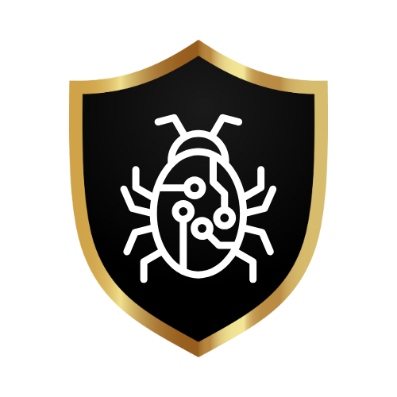

# Simple Antivirus

<!-- Improved compatibility of back to top link: See: https://github.com/othneildrew/Best-README-Template/pull/73 -->
<a id="readme-top"></a>

<!-- PROJECT SHIELDS -->
<!--
*** I'm using markdown "reference style" links for readability.
*** Reference links are enclosed in brackets [ ] instead of parentheses ( ).
*** See the bottom of this document for the declaration of the reference variables
*** for contributors-url, forks-url, etc. This is an optional, concise syntax you may use.
*** https://www.markdownguide.org/basic-syntax/#reference-style-links
-->


<!-- PROJECT LOGO -->
<br />
<div align="center">
  <a href="https://github.com/A1tered/SimpleAntivirus">
    
  </a>

  <h3 align="center">Simple Antivirus</h3>

  <p align="center">
    Simple Antivirus (SAV) is an awesome and Simple AntiVirus project made by a small team of students at Swinburne University!
    <br />
    <a href="https://github.com/A1tered/SimpleAntivirus">View Demo</a>
  </p>
</div>


<!-- TABLE OF CONTENTS -->
<details>
  <summary>Table of Contents</summary>
  <ol>
    <li>
      <a href="#about-the-project">About The Project</a>
      <ul>
        <li><a href="#built-with">Built With</a></li>
      </ul>
    </li>
    <li><a href="#repository-structure">Repository Structure</a></li>
    <li>
      <a href="#getting-started">Getting Started</a>
      <ul>
        <li><a href="#prerequisites">Prerequisites</a></li>
        <li><a href="#installation">Installation</a></li>
      </ul>
    </li>
    <li><a href="#usage">Usage</a></li>
    <li><a href="#roadmap">Roadmap</a></li>
    <li><a href="#contributing">Contributing</a></li>
    <li><a href="#license">License</a></li>
    <li><a href="#contact">Contact</a></li>
    <li><a href="#acknowledgments">Acknowledgments</a></li>
  </ol>
</details>

## DISCLAIMER
### Simple Antivirus is a student project and is provided "as is", and therefore is limited in functionality. It does not receive definition updates and does not support behavioural-based detection or heuristics. It should not be used as a replacement for traditional antivirus software. The authors are not liable for any damage to your computer from incorrect usage of the software. Licensed under the MIT License. See LICENSE.txt for more information.

<!-- ABOUT THE PROJECT -->
## About The Project

Simple Antivirus (SAV) is a lightweight and simple antivirus solution designed to protect Windows computers from potentially malicious activities, files, and processes. This project aims to deliver a simple yet powerful tool that runs quietly in the background, safeguarding your device through various detection methods including file hash scanning, malicious code checking, terminal monitoring and integrity checking.

Key Features:
* <b>Installation</b>: Easily set up Simple Antivirus on your Windows machine with a straightforward setup package. We chose .msi as it is simple to create the installer from and allows easy deployment for system administrators. Administrators can use Group Policy Editor to assign the program to either specific users or the entire computer.
If an assigned user logs onto the computer, the program will be installed for them, and if it is assigned to a computer, the first user to log on will install the program for use by everyone. 
* <b>Alerts</b>: Alerts are utilised thoroughly throughout the program. Alerts are displayed via Windows Toast notifications. If the same component sends more than one alert within a short timeframe, the alerts will be aggregated and the alert shown will display “There are 'number' new alerts for 'Component' , with the suggested action to “Review protection history immediately!” 
* <b>File Hash Scanning</b>: Reads files from a given directory, computes its SHA1 hash and compares the hash to the SQLite database of hash signatures. If a match is found, the file is quarantined. Using the ‘Mark as Malicious’ page, hashes can be added to the blacklist by the user. Users can browse for files on the computer to be added, of which the file will be automatically quarantined. SHA1 hashes can also be manually added, and input validation is used to ensure a valid hash is entered.
* <b>File Quarantine</b>: When a malicious file is found  (either by hash or if it contains malicious code), the file will be sent to <i>quarantine</i>. Using the GUI, the quarantined files can be managed. In the Quarantined Items page, files can be unquarantined, added to a whitelist, or deleted. Files that are unquarantined will be moved back to their original location and permissions will be restored. Add a file to the whitelist to unquarantine it, and mark it as safe. This will ensure the file is ignored by the Quarantine function if it is detected again in a scan. Deleting a quarantined file will permanently delete the file, it will <b>NOT</b> send it to the Recycle Bin. Remove a file from the whitelist using the Whitelist GUI page and selecting Remove from Whitelist.
* <b>Integrity Checking</b>: Ensure the security of sensitive files. When a user selects files or folders to be integrity checked, the hash, file size, and existence of the file will be monitored. If any changes are detected, an integrity violation will be detected and an alert will be raised. Integrity scans can be conducted manually, but it also runs in the background and will reactively alert users of any violations.
* <b>Malicious Code Scanning</b>: The malicious code scan runs simultaneously alongside the File Hash scan, and reads files in the directories, and searches for text-based files in either .bat, .txt or .pdf file formats for potentially malicious CMD or PowerShell commands.
* <b>Protection History</b>: View all previously sent alerts here, and by clicking on an alert and then the Details button, the full details of the alert can be read in a neat view, which may prove useful to administrators. The alerts log can be cleared at any time.
* <b>Terminal Scanning</b>: SAV monitors Command Prompt and PowerShell and sends an alert whenever the command line is used to access the Windows Registry. SAV does not block the registry from being accessed, it merely alerts the user that the registry is being accessed. There is also a check to ensure that SAV behaviour is not alerted.

SAV is designed to be a user-friendly yet powerful antivirus solution, providing essential protection without overwhelming users with unnecessary features or complexity.

The Simple Antivirus (SAV) project was initiated on the 27th of Febuary, with the goal of developing a robust yet simple antivirus solution for Windows users. The project was conceptualised, planned, and executed by a dedicated team of developers, including Tim, Zach, Pawan, Chris, Joel, and Johann. Each team member contributed their expertise to various aspects of the project, from coding the core functionalities to planning and implementing the detection mechanisms. This teams collaborative efforts have resulted in a reliable and user-friendly antivirus solution that meets the needs of a wide range of users.

<p align="right">(<a href="#readme-top">back to top</a>)</p>


<!-- Built With-->
### Built With

This section should list any major frameworks/libraries used to bootstrap your project. Leave any add-ons/plugins for the acknowledgements section. Here are a few examples.

* [![.NET 8.0][.NET8.0.js]][.NET8.0-url]
* [![WPF UI][WPFUI.js]][WPFUI-url]
* [![SQLite][SQLite.js]][SQLite-url]

<p align="right">(<a href="#readme-top">back to top</a>)</p>


<!-- Repo Structure -->
## Repository Structure

The repository is organised into two main folders: AntiVirus and Archive. Each folder serves a distinct purpose in the development and organisation of the Simple Antivirus (SAV) project.

* AntiVirus:
This folder contains the core of the project, where the final, integrated version of the Simple Antivirus resides. All team members contribute their completed functionalities here, ensuring that the antivirus is cohesive and fully functional. The AntiVirus folder is the central hub where all features, from real-time monitoring to file scanning, come together to form the finished product. Additionally, this is where the test files and projects are location for the testing phase of the project. 

* Archive:
The Archive folder is a dedicated space for experimentation and development of individual functionalities. Here, team members create drafts, prototypes, and test versions of the components before they are finalised. This allows for iterative development and testing of new ideas without affecting the stability of the main project. Once a feature is polished and fully developed, it is then integrated into the main AntiVirus project. Proof concepts being the first draft of each function, and v2 folder being the polished code that is used and prepared to be integrated into the main project. Additional files in archive include backup and original code that may be useful in future.

<p align="right">(<a href="#readme-top">back to top</a>)</p>


<!-- GETTING STARTED -->
## Getting Started

This is an example of how you may give instructions on setting up your project locally.
To get a local copy up and running follow these simple example steps.

### Prerequisites

This is an example of how to list things you need to use the software and how to install them.
* npm
  ```sh
  npm install npm@latest -g
  ```

### Installation

_Below is an example of how you can instruct your audience on installing and setting up your app. This template doesn't rely on any external dependencies or services._

1. Get a free API Key at [https://example.com](https://example.com)
2. Clone the repo
   ```sh
   git clone https://github.com/your_username_/Project-Name.git
   ```
3. Install NPM packages
   ```sh
   npm install
   ```
4. Enter your API in `config.js`
   ```js
   const API_KEY = 'ENTER YOUR API';
   ```

<p align="right">(<a href="#readme-top">back to top</a>)</p>


<!-- USAGE EXAMPLES -->
## Usage

Use this space to show useful examples of how a project can be used. Additional screenshots, code examples and demos work well in this space. You may also link to more resources.

_For more examples, please refer to the [Documentation](https://example.com)_

<p align="right">(<a href="#readme-top">back to top</a>)</p>

<!-- LICENSE -->
## License

Distributed under the MIT License. See `LICENSE.txt` for more information.

<p align="right">(<a href="#readme-top">back to top</a>)</p>


<!-- CONTACT -->
## Contact

Timothy Loh - [LinkedIn](https://www.linkedin.com/in/your_username) - email@example.com

Zachary Smith - [LinkedIn](https://www.linkedin.com/in/zachsmith-zip) - zachjsmith.zip@gmail.com

Pawanpreet Singh - [LinkedIn](https://www.linkedin.com/in/your_username) - email@example.com

Christopher Thompson - 103995646@student.swin.edu.au

Joel Parks - [LinkedIn](https://www.linkedin.com/in/joel-p-b613a6292) - 103981674@student.swin.edu.au 

Johann Banaag - [LinkedIn](https://www.linkedin.com/in/johannbanaag) - johannbanaag21@gmail.com


Project Link: [https://github.com/A1tered/COS40005_AntiVirusProject](https://github.com/A1tered/COS40005_AntiVirusProject)

<p align="right">(<a href="#readme-top">back to top</a>)</p>


<!-- ACKNOWLEDGEMENTS -->
## Acknowledgements

Use this space to list resources you find helpful and would like to give credit to. I've included a few of my favorites to kick things off!

* [Choose an Open Source License](https://choosealicense.com)
* [GitHub Emoji Cheat Sheet](https://www.webpagefx.com/tools/emoji-cheat-sheet)
* [Malven's Flexbox Cheatsheet](https://flexbox.malven.co/)
* [Malven's Grid Cheatsheet](https://grid.malven.co/)
* [Img Shields](https://shields.io)
* [GitHub Pages](https://pages.github.com)
* [Font Awesome](https://fontawesome.com)
* [React Icons](https://react-icons.github.io/react-icons/search)

<p align="right">(<a href="#readme-top">back to top</a>)</p>

<!-- MARKDOWN LINKS & IMAGES -->
<!-- https://www.markdownguide.org/basic-syntax/#reference-style-links -->
[.NET8.0.js]: https://img.shields.io/badge/.NET%208.0-purple?style=for-the-badge&logo=dotnet&color=purple
[.NET8.0-url]: https://dotnet.microsoft.com/en-us/download/dotnet/8.0
[WPFUI.js]: https://img.shields.io/badge/WPF%20UI-blue?style=for-the-badge
[WPFUI-url]: https://wpfui.lepo.co
[SQLite.js]: https://img.shields.io/badge/SQLite-%23003B57?style=for-the-badge&logo=sqlite
[SQLite-url]: https://www.nuget.org/packages/Microsoft.Data.Sqlite/
